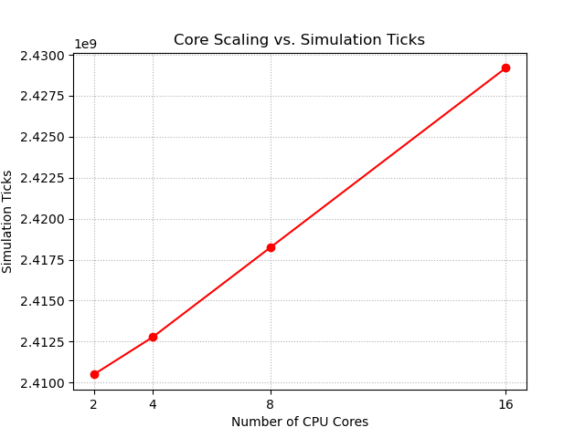
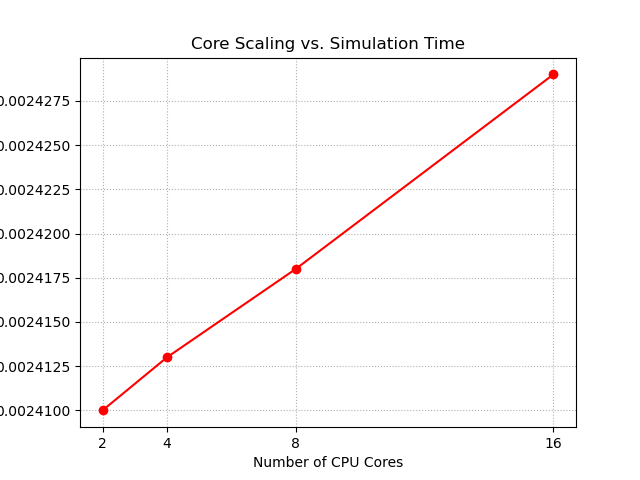
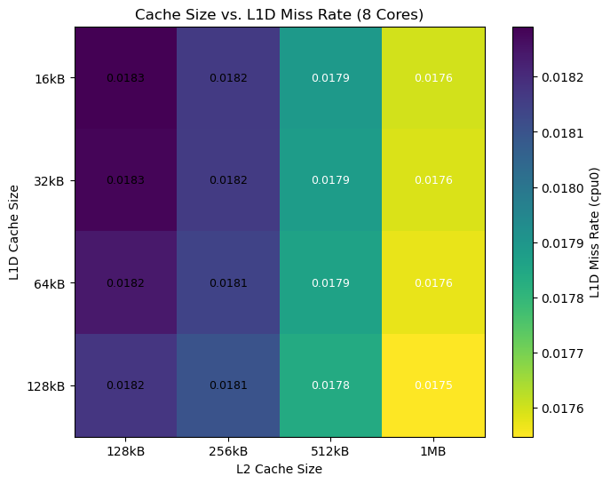
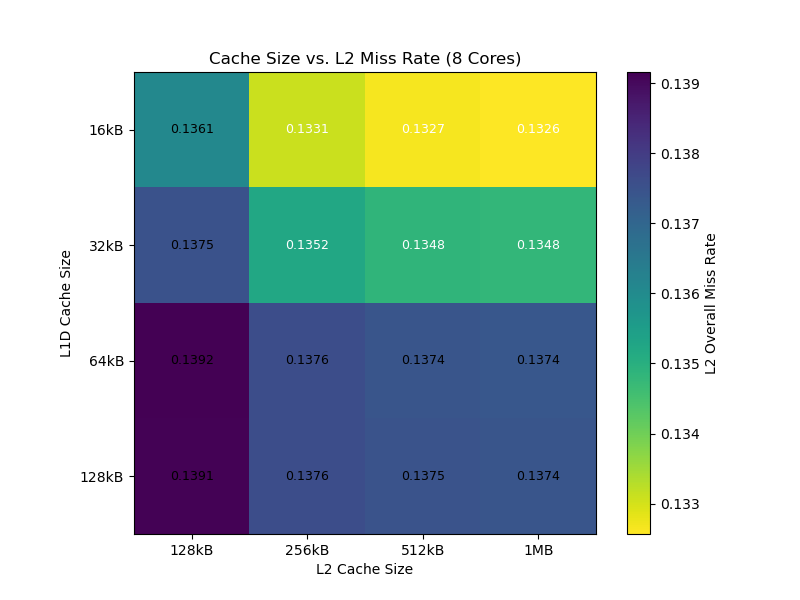
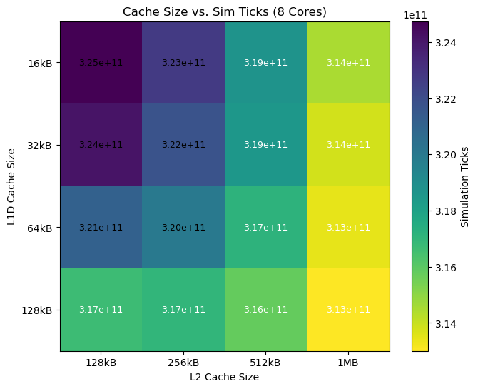
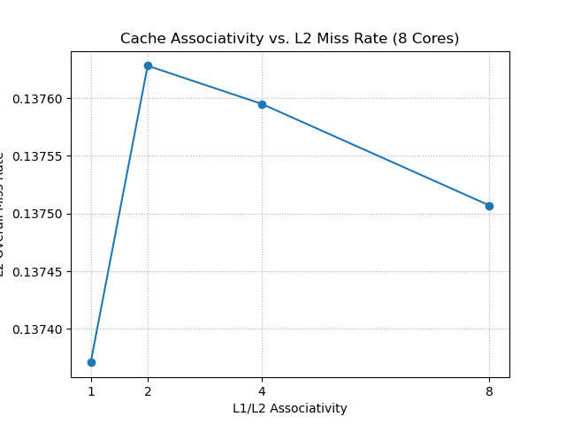
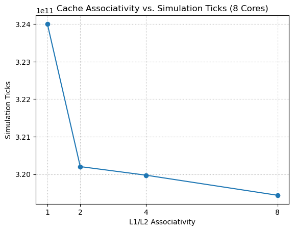

<!-- PROJECT LOGO -->
<br />
<p align="center">
  <a href="https://github.com/harshit-raj15/x86-Performance-Analysis">
    
  </a>

  <h3 align="center">x86 Performance Analysis</h3>

  <p align="center">
    Analyzing CPU Core, Cache Size, and Associativity Scaling
  </p>
</p>

<details open="open">
  <summary>Table of Contents</summary>
  <ol>
    <li>
      <a href="#about-the-project">About The Project</a>
    </li>
    <li><a href="#getting-started">Getting Started</a>
      <ul>
        <li><a href="#prerequisites">Prerequisites</a></li>
        <li><a href="#setup-and-compilation">Setup and Compilation</a></li>
      </ul>
    </li>
    <li><a href="#usage">Usage</a></li>
    <li><a href="#results">Results</a></li>
    <li><a href="#license">License</a></li>
    <li><a href="#authors">Authors</a></li>
    <li><a href="#acknowledgements">Acknowledgements</a></li>
  </ol>
</details>

## About The Project

This project uses the **gem5 simulator** to analyze the performance and scaling of a parallel merge sort algorithm on an **x86 architecture**. The workload is implemented in C++ using **OpenMP** to enable multi-threading.

The analysis is broken into three main experiments:

* **Core Scaling:** Measures how execution time changes as the number of CPU cores increases (e.g., 2, 4, 8, 16).
* **Cache Size Scaling:** Analyzes the impact of different L1 and L2 cache sizes on performance.
* **Cache Associativity Scaling:** Investigates how L1 and L2 cache associativity affects hit rates and execution time.

The final results are collected from gem5's  output files and plotted using a Python script.

## Getting Started

Follow these steps to set up the project environment and compile the workload.

### Prerequisites

* A working build of the [gem5 Simulator](https://www.gem5.org/documentation/learning_gem5/part1/building) (for X86)
* `g++` compiler with OpenMP support
* `python3`

### Setup and Compilation

1.  Create a folder inside your gem5 configuration directory:
    ```bash
    mkdir gem5/configs/final_project
    cd gem5/configs/final_project
    ```

2.  Copy the necessary simulation scripts from the gem5 common directories:
    ```bash
    cp ../deprecated/example/se.py .
    cp ../common/Caches.py .
    cp ../common/CacheConfig.py .
    ```

3.  Add the parent `configs` directory to your `PYTHONPATH` so gem5 can find the modules:
    ```bash
    export PYTHONPATH=$PYTHONPATH:$(pwd)/..
    ```
    *(Note: This line is also added in all the script so you can skip it!)*

4.  Compile the parallel sort algorithm using `g++` to get the binary file. The `-static` flag is important for gem5's SE mode.
    ```bash
    g++ -o sort_algorithm_binary -fopenmp -static sort_algorithm.cpp
    ```
    *(Note: The binary file is already generated and you can find it in the repo so you can skip this!)*

## Usage

Once the project is set up and the binary is compiled, you can run the analysis scripts.

*  Make the simulation scripts executable:
    ```bash
    chmod +x core_scaling.sh
    chmod +x cache_size_scaling.sh
    chmod +x cache_associativity_scaling.sh
    chmod +x run_all.sh
    ```

### Option 1: Run Manually

*  Run the scaling experiments **one after another**. This is critical to prevent them from overwriting each other's output files.
    ```bash
    # Run the script to get core scaling result
    ./core_scaling.sh
    
    # Run the script to get cache size scaling result
    ./cache_size_scaling.sh
    
    # Run the script to get cache associativity scaling result
    ./cache_associativity_scaling.sh
    ```

*  After the simulations are complete, run the Python script to generate the final plots:
    ```bash
    python3 final_plot.py
    ```

### Option 2: Run All (Recommended)

*  You can skip the manual steps by directly running the `run_all.sh` script. This will execute all three scaling experiments sequentially and then automatically run the Python script to generate the final plots.
    ```bash
    # Run all experiments and generate plots
    ./run_all.sh
    ```

## Results

You will find all the result plot in **output_plot** directory.

### Core Scaling
| Ticks vs Cores | Execution Time vs Cores |
| :---: | :---: |
|  |  |

### Cache Size Scaling
| L1D Miss Heatmap | L2 Miss Heatmap | Ticks Heatmap |
| :---: | :---: | :---: |
|  |  |  |

### Cache Associativity Scaling
| L1D Misses vs Associativity | L2 Misses vs Associativity | Ticks vs Associativity |
| :---: | :---: | :---: |
|  |  |  |

## License

All softwares are free to use for commercial and educational purposes with proper references given.

## Authors

<p>Harshit Raj - harshitraj@ufl.edu</p>
<p>Nitesh Bakhati - nitesh.bakhati@ufl.edu</p>
<p>Dev Hitesh Parmar - d.parmar@ufl.edu</p>
<p>Kanak Sharma - kr.sharma@ufl.edu</p>

## Acknowledgements

* [Gem5](https://www.gem5.org)
* [Ubuntu](https://ubuntu.com/)
* [Python](https://www.python.org/)
* [OpenMP](https://www.openmp.org)
* [Matplotlib](https://matplotlib.org)